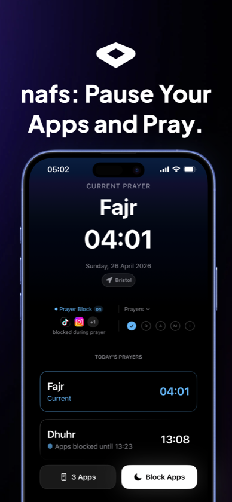
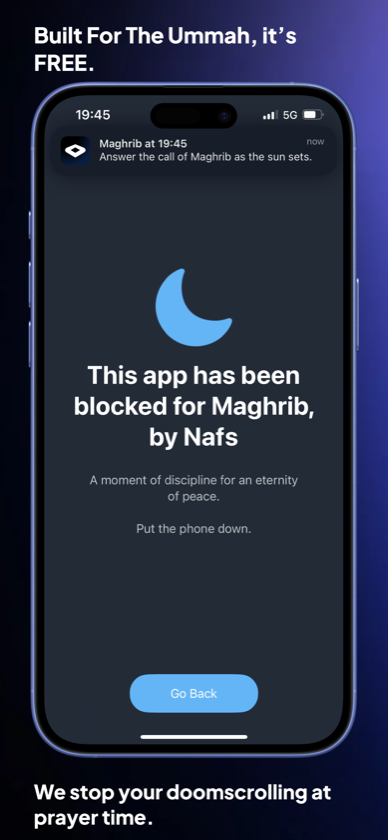
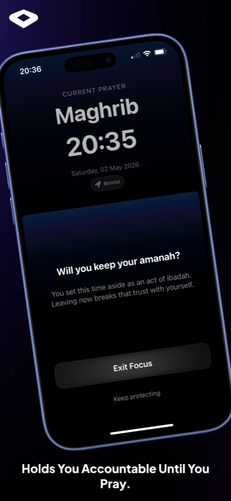
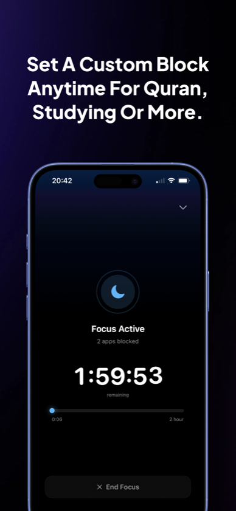
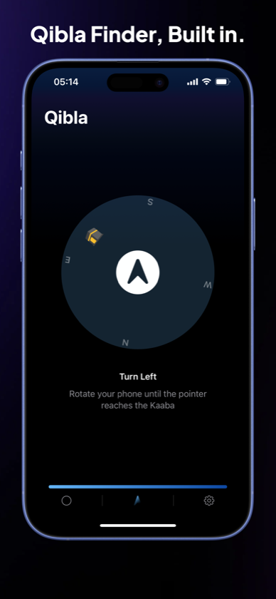
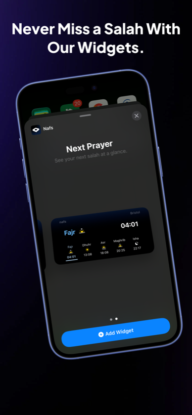
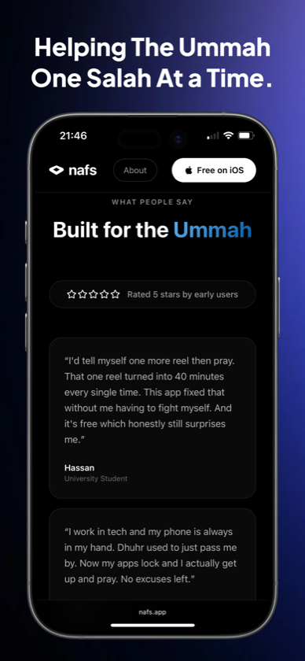
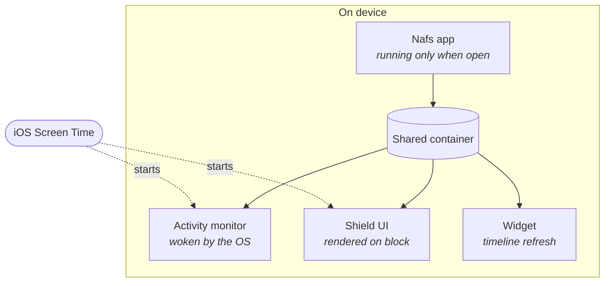
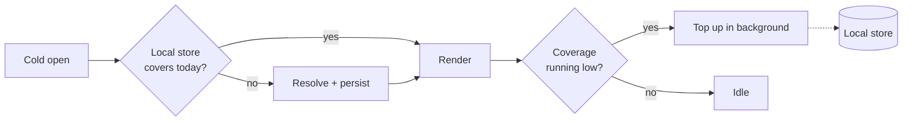

# nafs

### When Salah begins, pause your apps.

[**Download on the App Store**](https://apps.apple.com/app/id6759988828) &nbsp;·&nbsp; [nafs.app](https://nafs.app) &nbsp;·&nbsp; [Privacy](https://nafs.app/privacy)

Shipped April 2026 · 300+ downloads · 5.0★ from early users
 Used in the UK, US, Saudi Arabia and across Africa

---

## The problem

Salah time arrives. You tell yourself just five more minutes. The scroll does not stop. You look up, and the prayer has passed.

Every prayer-time app solves the information problem — it tells you when to pray. None of them solve the behavioural one. The adhan fires, the notification lands on a screen you are already looking at, and you dismiss it without deciding to. The gap isn't knowledge. It's the twenty seconds between intention and the next video.

> *"I'd tell myself one more reel then pray. That one reel turned into 40 minutes every single time. This app fixed that without me having to fight myself. And it's free which honestly still surprises me."*
>
> — **Hassan**, University Student

Nafs puts friction exactly where the failure happens. When the prayer window opens, the apps you chose stop opening.

---

## What it does

<table>
<tr>
<td width="50%"></td>
<td width="50%"></td>
</tr>
<tr>
<td width="50%"></td>
<td width="50%"></td>
</tr>
<tr>
<td width="50%"></td>
<td width="50%"></td>
</tr>
</table>

**Prayer times, wherever you are.** Resolved for your location, correct offline, with calculation method and Asr madhab under your control rather than assumed.

**Apps pause themselves.** Pick the apps that take your prayers. When the window opens they stop opening — no timer to start, no discipline required at the moment discipline is hardest.

**A shield, not a wall.** Opening a blocked app doesn't show an error. It shows why you set the block, with a hadith or an ayah, and a way out if you genuinely need one.

**Focus on demand.** Custom blocks from 5 minutes to 4 hours, for Quran, study, or anything else.

**Qibla compass** with live heading, and **home and lock screen widgets** for the next prayer.

Free. No sign-up, no account, no ads.

---

## Traction

- **300+ downloads** since launching on 27 April 2026
- **5.0★** from early users
- Users across the **UK, United States, Saudi Arabia and Africa**
- Currently on **v1.1.4** — still shipping

> *"I work in tech and my phone is always in my hand. Dhuhr used to just pass me by. Now my apps lock and I actually get up and pray. No excuses left."*

Figures as of September 2026.

---

## Product decisions

**A block you can dismiss in one tap isn't a block. A block you can't dismiss gets the app deleted.**
The first build let you exit focus instantly. Users exited, felt worse, and blamed the app for not stopping them. The second put one screen between you and the exit — *"Will you keep your amanah? You set this time aside as an act of ibadah. Leaving now breaks that trust with yourself."* No lock, no penalty, no shame. Just the reason you set it, restated at the moment you'd forgotten it. Exits fell, and nobody churned over feeling trapped.

**Automatic beats manual, because the user is already losing.**
Manual focus sessions assume you'll open the app and start one — at precisely the moment you're least likely to. Auto-focus ties blocking to the prayer window itself. The core value happens whether or not the user remembers the app exists.

**The shield had to feel like the app's voice, not the OS's.**
iOS's default blocked-app screen is a grey dead end. Ours carries the reason you're seeing it. A block that feels like punishment gets disabled within a week; a block that feels like a reminder gets kept.

**Free, with no path to a paywall yet.**
The audience is people building a habit they already want. Charging at the point of religious practice changes the relationship. That decision gets revisited when retention justifies it — not before.

### What I said no to

- **No accounts.** Nothing to sign up for, nothing to leak.
- **No streaks as leaderboards.** Prayer isn't a competition, and social comparison would cheapen it.
- **No unbreakable lock.** Users who feel trapped uninstall. Friction, not force.
- **No Android yet.** iOS retention has to prove the thesis first.
- **No ads.**

---

## System design

The source is private, so what follows is the shape of the problem rather than the implementation. The interesting work in this app isn't in the UI — it's in operating inside constraints the platform sets and doesn't negotiate.

### Four processes, one session

For most of a focus session the app isn't running. The OS starts the monitor when a prayer window opens and the shield when a blocked app is launched — each in its own process, on its own schedule, with no ability to call back into the app. Anything they need has to already be written where they can reach it, in a form they can use without work.

That inverts the usual design pressure. The app's job isn't to be fast when it's open; it's to leave behind state that three other processes can read correctly when it isn't.

### Nothing the user sees waits on a network

Prayer times are resolved in batches and read locally from then on. A cold open renders from the local store with no round trip, which means the app behaves identically on the Tube, in a basement, and in a mosque with no signal. A blank prayer-time screen at Maghrib isn't a degraded experience — it's a product failure, so the network was designed off the critical path entirely.

Storage is bounded rather than append-only: a short trailing window is retained for context and older days are evicted, so a year of use costs roughly what a month does.

**There is no account.** Nothing to sign up for, nothing to verify, no identity your prayer history hangs off. That's a product decision before it's a technical one — an app built around a private act of worship shouldn't need to know who you are in order to work.

### Working inside an extension's budget

Extensions get a fraction of the app's memory ceiling, and exceeding it means the OS kills you mid-render. For the shield that isn't a crash the user forgives — it's a blocked app that silently opens.

So the extensions do almost nothing. The shield reads pre-resolved state and draws it: no decoding, no image loading, no computation at render. Widget timelines are built ahead of time by the app rather than assembled during a refresh. The expensive work happens in the one process that can afford it, and everything downstream consumes the result.

### Constraints that shaped the build

| Constraint | Why it's hard | The trade |
|---|---|---|
| Extensions run under a fraction of the app's memory ceiling | Overrun means the OS kills the process — a shield that dies is a block that fails open | Extensions read pre-resolved state; all real work happens in the app |
| iOS keeps only the 64 soonest local notifications | Five prayers across multiple notification types exhausts the budget within days | Scheduling horizon capped and rolled forward; users never hit a silent day |
| Reminders must fire for weeks with the app never opened | Background execution isn't guaranteed; scheduled work expires quietly | Horizon re-established on every launch rather than assumed to persist |
| Prayer times are a contested calculation | The same coordinates yield several *valid* answers by method and madhab | Both are user-owned settings, never defaults imposed on them |
| Users span Bristol, Riyadh and Lagos | Timezones, DST, and high-latitude cases where conventional methods break | Times resolve against location, not device locale |
| Screen Time requires Apple's entitlement | Not grantable on demand — a hard dependency on review before any of this ships | v1 scoped to what the entitlement actually permits |

**Built with** — SwiftUI · Screen Time (FamilyControls + DeviceActivity) · WidgetKit · CoreLocation · UserNotifications

---

## Roadmap

- **Shipping now** — manual location search, for users who'd rather not share GPS
- **Next** — richer focus history, so the habit is visible over weeks rather than days
- **Considering** — Android, once iOS retention justifies a second platform

---

## About

I'm Raiyan Abedin. I built Nafs because I had the problem and none of the existing apps addressed it — they told me when to pray, then got out of the way at the exact moment I needed them not to.

Nafs is a commercial product; the source is private. This repo is the product and engineering write-up.

[App Store](https://apps.apple.com/app/id6759988828) &nbsp;·&nbsp; [nafs.app](https://nafs.app) &nbsp;·&nbsp; [Privacy](https://nafs.app/privacy)
